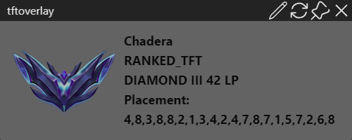
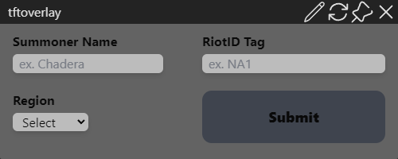
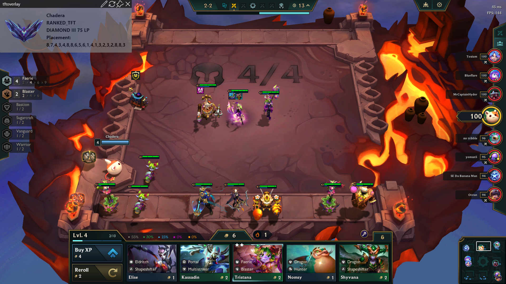

# tftoverlay [WIP]

A transparent overlay for Teamfight Tactics that tracks recent placements and current rank. Inspired by [tracker.gg](https://tracker.gg/overlays) streaming overlay.

## Installation
- Go to [Releases](https://github.com/chidera-nwankwo/tftoverlay/releases)
- Download the latest .7z and extract it
- Run `tftoverlay.exe`

## Screenshots

### Rank Overlay 

### Summoner Search

### Overlay In-Game

## How it Works

Application sends multiple requests to Riot Games' api through an AWS proxy (PuuID, Match History, Rank, Division, etc). 
- `renderer.js` - process handles rendering the UI and any changes made to it.
- `main.js` - process handles creation of browser windows and system operartions such as closing and setting the windows to be always on top.
- `preload.js` - process handles exposing Node.js modules to the renderer as `renderer.js` is a browser instance and does not have access to these modules by default.
- `forge.condfig.js` - handles the options for packaging. 

## For Developers
- Install [Node.js](https://nodejs.org/en/download/package-manager)
- Install Npm dependancies with `npm install`
- Rebuild output.css with `npx tailwindcss -i ./renderer/input.css -o ./renderer/output.css --watch`
- Run with `npx electronmon .`
- Make a distributable version with `npm run make`

## Credits
[Riot Games API](https://developer.riotgames.com/apis)

